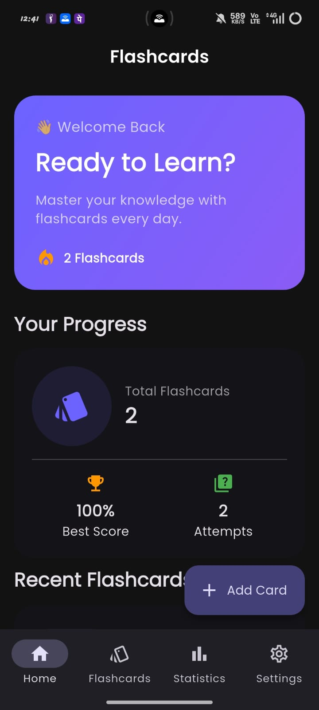
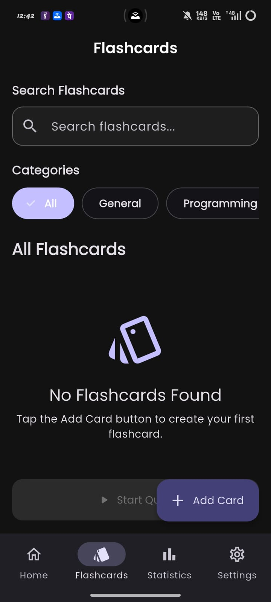
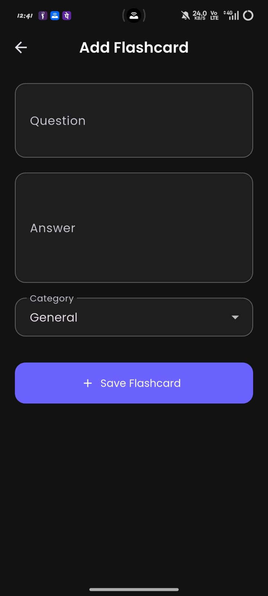
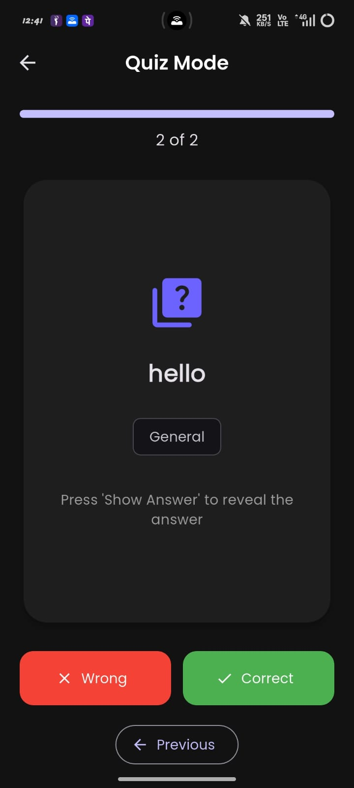
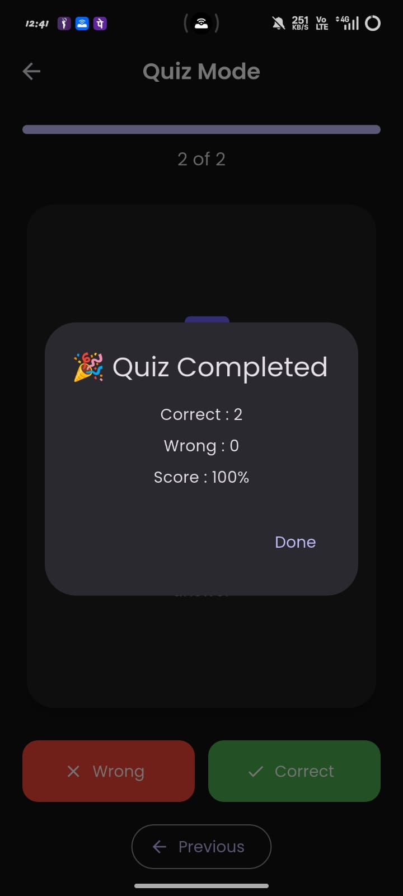
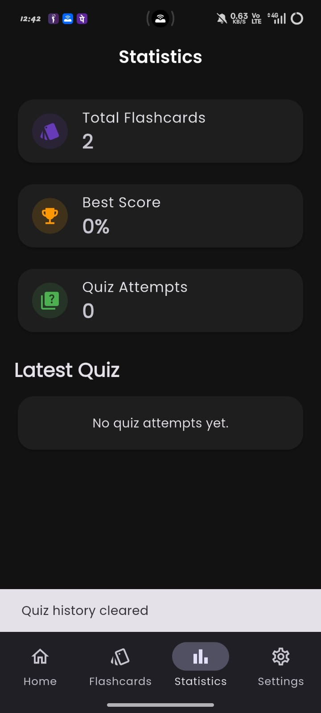
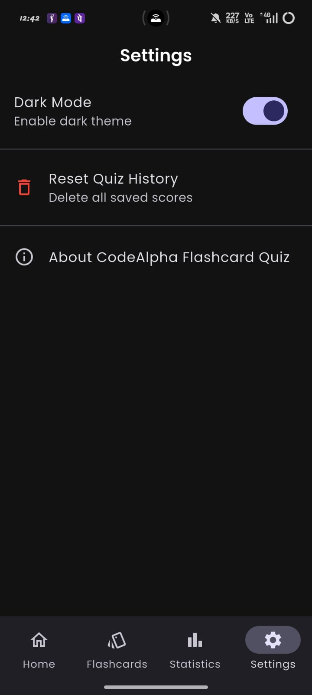
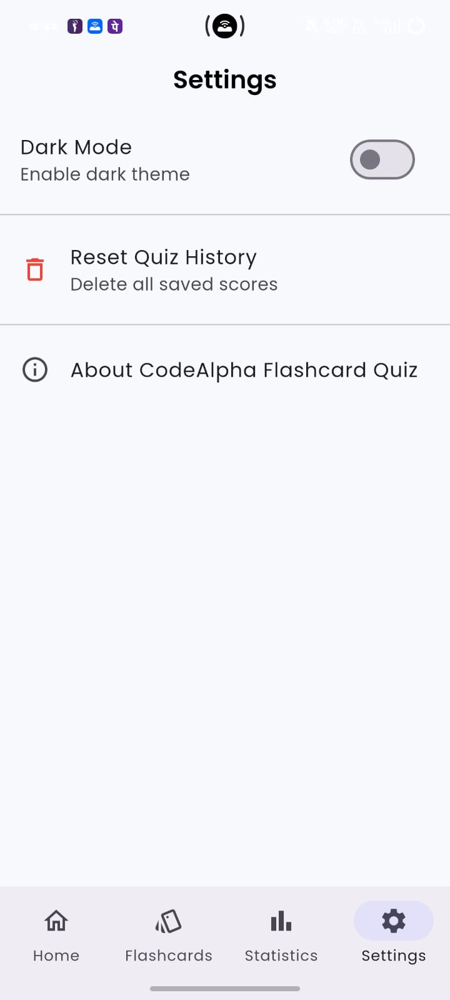

# 📚 Flashcard Quiz App

A modern and interactive **Flashcard Quiz Application** built with **Flutter** as part of my **CodeAlpha App Development Internship**.

The app helps users create, organize, and study flashcards through an interactive quiz experience. It includes complete flashcard management, category filtering, search, animated card flipping, score tracking, statistics, local data storage, and light/dark theme support.

---

## 🚀 CodeAlpha Internship Project

**Internship Domain:** App Development  
**Organization:** CodeAlpha  
**Project:** Flashcard Quiz App  
**Project Type:** Flutter Mobile Application  

### Task Objective

Create a flashcard quiz app for studying where users can:

- View a question on the front of a flashcard and the answer on the back.
- Reveal answers using a **Show Answer** button.
- Navigate through flashcards.
- Add, edit, and delete flashcards.
- Use a simple, clean, and user-friendly interface.

The project was further enhanced with additional features such as categories, search, quiz scoring, statistics, local database storage, dark mode, and bottom navigation.

---

## ✨ Features

- ➕ **Add Flashcards** — Create new flashcards with questions, answers, and categories.
- ✏️ **Edit Flashcards** — Update existing flashcard content.
- 🗑️ **Delete Flashcards** — Remove unwanted flashcards with confirmation.
- 🔍 **Search Flashcards** — Quickly find flashcards using keywords.
- 🏷️ **Category Filtering** — Filter cards by General, Programming, Science, Mathematics, English, and more.
- 🎴 **Interactive Quiz Mode** — Study flashcards in a dedicated quiz experience.
- 🔄 **Flip Card Animation** — Reveal answers with an animated flashcard flip.
- 👁️ **Show Answer** — Display the answer before marking the response.
- ✅ **Correct / Wrong Tracking** — Track performance during quizzes.
- 🏆 **Best Score Tracking** — Save and display the highest quiz score.
- 🎯 **Quiz Attempts** — Track the total number of quiz attempts.
- 📊 **Statistics Dashboard** — View total flashcards, best score, attempts, and latest quiz performance.
- 💾 **Local Database** — Store flashcards and progress locally using SQLite.
- 🌙 **Dark Mode** — Switch between light and dark themes.
- ⚙️ **Settings** — Manage theme preferences and reset quiz history.
- 📱 **Bottom Navigation** — Easy navigation between Home, Flashcards, Statistics, and Settings.
- 🔄 **Pull to Refresh** — Refresh flashcard data easily.

---

## 📱 App Screenshots

<table>
  <tr>
    <td align="center"><b>Home</b></td>
    <td align="center"><b>Flashcards</b></td>
    <td align="center"><b>Add Flashcard</b></td>
  </tr>
  <tr>
    <td></td>
    <td></td>
    <td></td>
  </tr>
  <tr>
    <td align="center"><b>Quiz Mode</b></td>
    <td align="center"><b>Quiz Completed</b></td>
    <td align="center"><b>Statistics</b></td>
  </tr>
  <tr>
    <td></td>
    <td></td>
    <td></td>
  </tr>
  <tr>
    <td align="center"><b>Settings</b></td>
    <td align="center"><b>Light Mode</b></td>
    <td></td>
  </tr>
  <tr>
    <td></td>
    <td></td>
    <td></td>
  </tr>
</table>

---

## 🛠️ Tech Stack

| Technology | Purpose |
|---|---|
| **Flutter** | Cross-platform application development |
| **Dart** | Programming language |
| **Provider** | State management |
| **SQLite / Sqflite** | Local database storage |
| **Shared Preferences** | Theme and preference persistence |
| **Flip Card** | Flashcard flip animation |
| **Google Fonts** | Application typography |
| **Material 3** | Modern UI components and theming |

---

## 📦 Packages Used

```yaml
provider: ^6.1.5
sqflite: ^2.4.2
path: ^1.9.1
shared_preferences: ^2.5.3
flip_card: ^0.7.0
google_fonts: ^6.3.1
```

The project also uses:

```yaml
flutter_launcher_icons: ^0.14.4
```

for generating the custom application launcher icon.

---

## 🏗️ Project Structure

```text
lib/
├── core/
│   └── theme/
│
├── database/
│   └── database_helper.dart
│
├── models/
│   ├── category_model.dart
│   └── flashcard_model.dart
│
├── providers/
│   ├── flashcard_provider.dart
│   ├── score_provider.dart
│   └── theme_provider.dart
│
├── screens/
│   ├── add_edit_card/
│   │   └── add_edit_card_screen.dart
│   │
│   ├── flashcards/
│   │   └── flashcards_screen.dart
│   │
│   ├── home/
│   │   └── home_screen.dart
│   │
│   ├── main_navigation/
│   │   └── main_navigation_screen.dart
│   │
│   ├── quiz/
│   │   └── quiz_screen.dart
│   │
│   ├── settings/
│   │   └── settings_screen.dart
│   │
│   └── statistics/
│       └── statistics_screen.dart
│
├── services/
│   ├── flashcard_service.dart
│   └── score_service.dart
│
├── widgets/
│   ├── category_chip.dart
│   ├── flashcard_widget.dart
│   └── search_bar_widget.dart
│
└── main.dart
```

---

## 🎯 How the App Works

### 1. Create Flashcards

Users can add a flashcard by entering:

- A question
- An answer
- A category

The flashcard is stored locally on the device.

### 2. Manage Flashcards

Users can:

- Search for flashcards.
- Filter flashcards by category.
- Edit existing cards.
- Delete cards they no longer need.

### 3. Start a Quiz

From the Home screen, users can start Quiz Mode.

Each flashcard displays:

- The question on the front.
- A **Show Answer** button.
- The answer on the back using a flip animation.

After viewing the answer, users can mark their response as:

- ✅ Correct
- ❌ Wrong

### 4. Track Progress

After completing a quiz, the app stores performance data and updates:

- Best score
- Total quiz attempts
- Latest quiz performance
- Dashboard statistics

---

## ⚙️ Getting Started

### Prerequisites

Make sure you have installed:

- Flutter SDK
- Dart SDK
- Android Studio or VS Code
- Android SDK
- Git

### Clone the Repository

```bash
git clone https://github.com/ankitbhardwaj2710/codealpha_flashcard_quiz_app
```

### Navigate to the Project

```bash
cd codealpha_flashcard_quiz_app
```

### Install Dependencies

```bash
flutter pub get
```

### Run the Application

```bash
flutter run
```

---

## 📦 Build Release APK

To generate a release APK:

```bash
flutter build apk --release
```

The generated APK will be available at:

```text
build/app/outputs/flutter-apk/app-release.apk
```

---

## 🔮 Future Improvements

Possible future enhancements include:

- Custom user-created categories
- Spaced repetition learning
- Daily study streaks
- Quiz difficulty levels
- Detailed performance charts
- Cloud synchronization
- User authentication
- Import and export flashcard sets
- Notifications and study reminders

---

## 👨‍💻 Developer

**Ankit**

B.Tech — Artificial Intelligence & Machine Learning  
Flutter & Frontend Developer

This project was developed as part of the **CodeAlpha App Development Internship**.

---

## 🙏 Acknowledgement

Thanks to **CodeAlpha** for providing the opportunity to work on this project and strengthen practical skills in Flutter application development, state management, local databases, UI/UX design, and application architecture.

---

## ⭐ Support

If you find this project useful, consider giving the repository a ⭐ on GitHub.